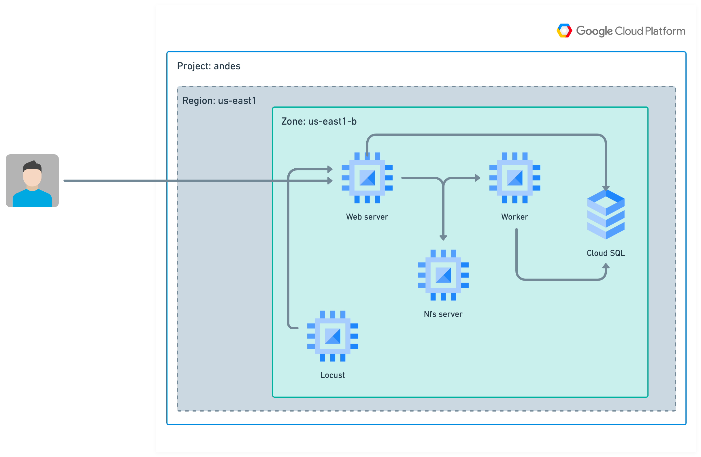

# sistema-conversion-cloud
Sistema que convierte un archivo de un tipo a otro


## Commands

Abra una terminal en la raíz del proyecto y ejecute lo siguiente para el desarrollo local:

```shell
docker-compose -f local.yml build
```

Y luego ejecuta:

```shells
docker-compose -f local.yml up
```

Este comando se utiliza para inicializar una base de datos en una aplicación Flask que se ejecuta dentro de un contenedor Docker.

```shell
docker-compose -f local.yml run --rm app flask db init
```

Este comando se utiliza para generar un archivo de migración en una aplicación Flask que utiliza la extensión Flask-Migrate.

```shell
docker-compose -f local.yml run --rm app flask db migrate
```


Este comando se utiliza para aplicar una migración a la base de datos en una aplicación Flask que utiliza la extensión Flask-Migrate

```shell
docker-compose -f local.yml run --rm app flask db upgrade
```

## Commands for docker metrics with prometheus and grafana

```shell
docker-compose -f local.test.yml build
```

```shell
docker-compose -f local.test.yml up
```

or this for arm64

```shell
docker-compose -f local.arm.test.yml build
```
```shell
docker-compose -f local.arm.test.yml up
```


### Locust

Run login test

```shell
docker-compose -f local.yml run -e SHAPE=LOGIN -p 8089:8089 --rm locust -f /mnt/locust/locustfile.py --host=http://nginx:80
```

Run create task test

```shell
docker-compose -f local.yml run -e SHAPE=CREATE_TASK -p 8089:8089 --rm locust -f /mnt/locust/locustfile.py --host=http://nginx:80
```

or with headless

Run login test

```shell
docker-compose -f local.yml run -e SHAPE=LOGIN --rm locust -f /mnt/locust/locustfile.py --host=http://nginx:80 --headless -u 100 -r 5
```

Run create task test

```shell
docker-compose -f local.yml run -e SHAPE=CREATE_TASK --rm locust -f /mnt/locust/locustfile.py --host=http://nginx:80 --headless -u 100 -r 5
```

## Infrastructure V1

Se uso terraform para el aprovisionamiento de la infraestructura en GCP en cual se encuentra en la siguiente ruta `.infra`

Comandos para aprovisionar la infraestructura

Primero instalar gcloud y configurar la cuenta de google cloud

[Instala la CLI de gcloud](https://cloud.google.com/sdk/docs/install?hl=es-419)

Despues,

[Instalar terraform](https://developer.hashicorp.com/terraform/tutorials/aws-get-started/install-cli)


Autenticacion con google cloud

```shell
gcloud auth application-default login
```

Ante subir un zip del repositorio a GCP, se debe de crear un bucket en GCP y subir el zip ahi y utilizar dicho bucket en la variable `gcs_bucket_name`

```shell

Ejecutar terraform

```shell
cd .infra
```

```shell
terraform init
```

```shell

terraform plan
```

```shell
terraform apply
```

Y para hacer la migraciones en produccion, recordar cambiar `us-east1-docker.pkg.dev/andes-384517/compressor-api/api:latest` por el nombre de la imagen que se subio a GCP

```shell
sudo docker run --env-file ./.envs/.local/.flask -e FLASK_APP="compressor.app:create_app" -e APP_SETTINGS="compressor.config.DevelopmentConfig" us-east1-docker.pkg.dev/andes-384517/compressor-api/api:latest flask db upgrade
```


